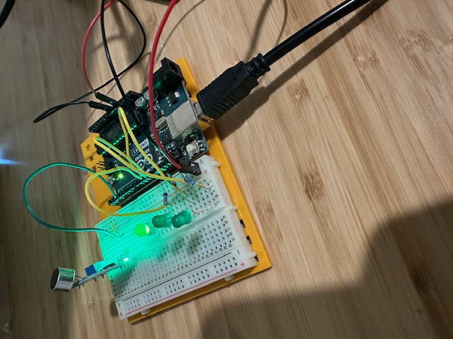

# Knock Lock

This is my own take on the starter kit's 12th project, "Knock Lock." It keeps track of the time between knocks to hard-code unique knock sequences.

There are 3 LEDs and each time a knock is detected, the LEDs alternate between which one is turned on. When the knocks are executed with the correct timing, all 3 LEDs turn on. The variable `isInTestMode` can be used to display the time between knocks to program a new knock combination.

