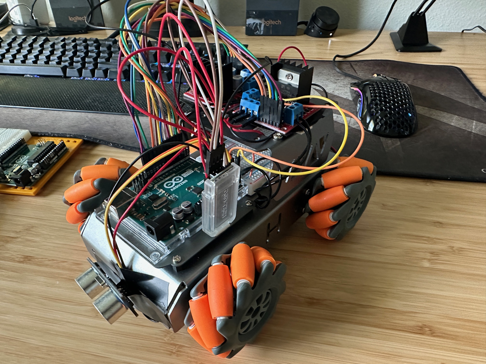
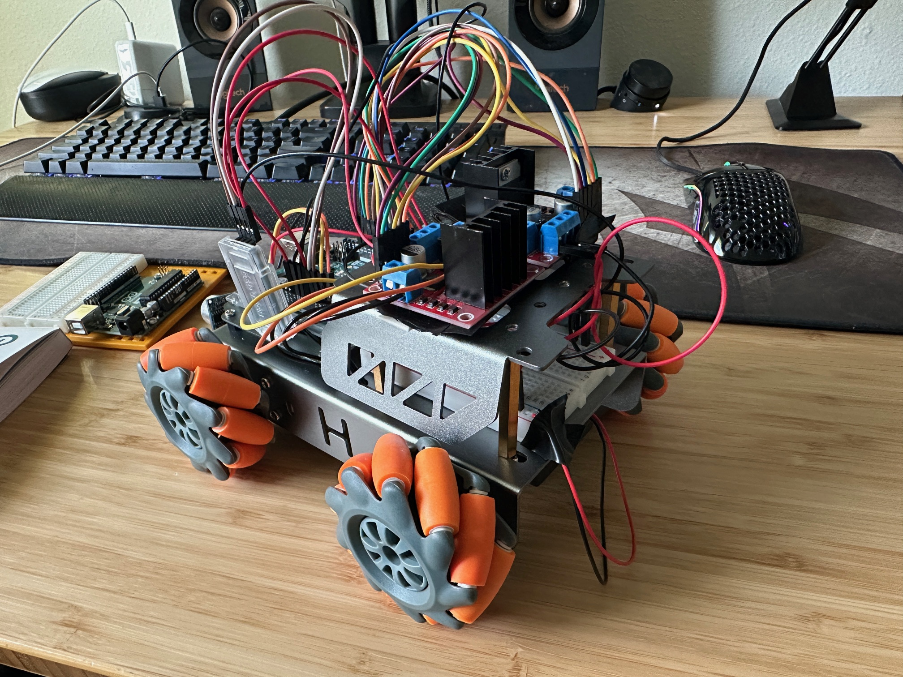
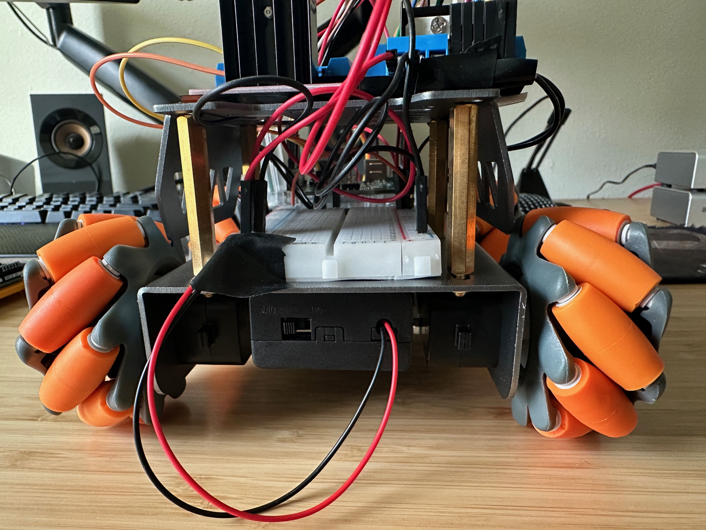

# Mecanum RC Car

I bought a kit from Amazon that included the chassis, wheels, and screws; everything else was done by me including the wiring and coding.

I used a HC-10 bluetooth module to be able to control the RC car with my phone. The bluetooth app I chose to use was Dabble and I also used their library to read the signals coming from the app. To power and control the motors, I used 2 L298N motor drivers powered by 2 18650 batteries.

 

